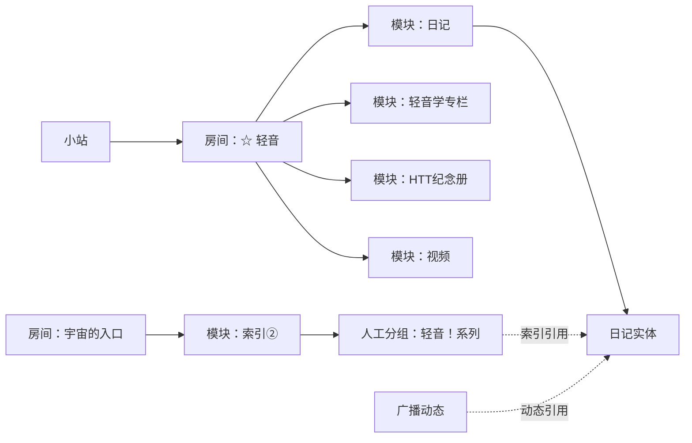

# 镜像站结构生成：分析与目标方案

日期：2026-09-30（Asia/Shanghai）。对象：当前工作区，包括未提交修改。

**目标判断：把“按文章分类生成的阅读站”改为“保留原站房间、模块、集合与链接关系的归档站”。原站拓扑是主结构；人工索引、全站文章/相册汇总是附加视图。所有页面与导航必须从同一份结构投影生成。**

可信度：对缓存快照中的结构偏差为高；对源站此刻的内容全集为中。在线读取 [原站](https://site.douban.com/211330/) 未成功，以下源站证据来自仓库保存的 200 响应 HTML，不能宣称与实时原站完全一致。采样时间、缓存时间、页面路径、文件哈希见 [evidence.json](./evidence.json)。分析期间其他工作仍在修改代码与产物，所以文件行号仅辅助定位，函数名与证据哈希才是本报告的基准。

本次仅添加分析文档、证据和只读采集脚本；没有修改生成器。既有代码审查报告关注运行可靠性，本方案补充其尚未覆盖的结构保真契约。

## 1. 真正的问题与设计约束

从终态反推：新增一个房间、房间改名、增加第二个日记模块，或者同一篇文章被多个索引引用时，正确的系统应更新结构数据并统一再生成，不需要维护者分别修改首页、分类、导航和 sidebar。

当前继承的约束是“VitePress 全站文章目录就是站点结构”。这个约束不成立：VitePress 是渲染工具，其文章目录习惯不能决定源站层级。当前内部的 `category`、`RoomArticleSection` 和专题标签映射也不是需要永久兼容的产品契约。

实际应该保留的约束是：已经保存的正文/图片、可重放的源 HTML、原站身份与来源、断点进度，以及已有可访问的详情 URL。旧 `/notes/{id}`、`/albums/{id}` 可以保留，不必重抓整站。旧汇总页可作为附加入口；它们不能再成为源站归属的依据。

四个不可违反的原则：

1. **源关系优先**：房间归属、模块顺序、列表顺序来自相应源页面；人工索引只决定人工索引自己的组织。
2. **身份与显示分离**：用源 ID 标识实体；标题、标签、分类文字不能承担身份或连接键。
3. **一个实体可以有多个入口**：详情去重，引用位置不去重。源归属、索引引用、广播引用分别记录。
4. **缺内容不删结构**：获取失败、只抓到预览、缺分页分别报告，不用空集合或“其他”掩盖。

## 2. 原站的实际骨架

缓存首页及 7 个房间页面的导航一致，顺序如下。每一行的模块顺序也直接来自源 DOM。

| 顺序 | 房间 ID / 标题 | 模块（源顺序） | 当前已归档日记 |
| --- | --- | --- | ---: |
| 1 | `2793793` 宇宙的入口 | 索引① `bulletin:16095492` → 索引② `bulletin:17754656` → 海报墙 `photos:13432051` → About PPK `bulletin:13430830` → 尚子的房间 `notes:17565710` | 45 |
| 2 | `3598399` ☆ 聲之形 | 公告栏 `bulletin:190597046` → 日记 `notes:190597056` → 相册 `photos:190597061` → 视频 `videos:191513700` | 35 |
| 3 | `2794121` ☆ 玉子 | 公告栏 `bulletin:13432767` → 商店街日常 `photos:13431474` → 商店街日记 `notes:13430893` → 幕后&周边 `photos:13433748` → 视频 `videos:13431492` | 26 |
| 4 | `2794136` ☆ 轻音 | 公告栏 `bulletin:13432819` → HTT纪念册 `photos:13431373` → 日记 `notes:15416684` → 轻音学专栏 `notes:13431360` → 视频 `videos:13431215` | 10 + 3 |
| 5 | `2794117` ☆ 悠风 etc. | 公告栏 `bulletin:190150869` → 日记 `notes:13431979` → 相册 `photos:13431950` → 视频 `videos:15768770` | 25 |
| 6 | `2794240` 留言板 | 兔子山论坛 `forum:13466509` | — |
| 7 | `3598411` 广播室 | 兔子山快报 `miniblog:13430546` | — |

合计 7 个房间、25 个模块：7 公告、6 日记、6 相册、4 视频、1 论坛、1 广播。人工索引覆盖 94 篇唯一日记，另有 50 篇未被该索引引用；这 50 篇仍有明确的源日记模块，不是失去归属的文章。

这里同时存在三种关系，不能相互替代：



## 3. 生成链路与已确认的偏差

现有链路：`parse_room_nav/parse_widgets` → `SiteDiscovery` → `SiteStructure`、各类 `data/*.json` → `SyncContext.generate_site` 中临时拼分类/排序/路由 → 多个 `emit_*` → Markdown、sidebar；顶栏仍在 `config.mts` 中手写；`Verifier` 主要校验数量、文件和链接存在性。

发现阶段已经保存了不少正确信息，丢失主要发生在模型的简化、跨集合扁平化和生成阶段的重新组织。恢复骨架无需另建爬虫。

| 已确认偏差 | 证据及发生位置 | 系统性原因 / 目标处理 |
| --- | --- | --- |
| 房间没有独立页面，主导航不是 7 个源房间 | `docs/rooms/`、`docs/widgets/` 不存在；`docs/.vitepress/config.mts` 的 `nav` 手写“站内/文章索引/相册/关于…” | 源 Room 只是文章分类辅助；改为房间页面和按 Room 生成的主导航 |
| 首页与文章索引遵循不同分组 | `emit_home` 仍遍历 `IndexGroup`，当前 `/notes/` 已变为 ☆ 聲之形、☆ 玉子、☆ 轻音、☆ 悠风 etc.、其他 | 独立模板各自决定分类；以统一 RenderPlan 生成。快照首页的 6 个 feature 目标均找不到对应文章标题锚点 |
| 首页房间被改名、移动位置 | `generate_site` 把“宇宙的入口”改为“其他”并移到最后；45 篇日记落入该组 | 把浏览视图当作源结构；还原房间名和原导航顺序。未知归属单独报 unresolved |
| 同房间多个日记模块被合并 | `RoomArticleSection.notes` 汇总 ☆ 轻音的两个 widget；页面只有一个 13 篇分组 | Room 不是最细容器；保留“日记 10 篇”“轻音学专栏 3 篇”的独立入口和集合 |
| 源列表顺序被人工索引覆盖 | `generate_site` 先扫全部索引，再补列表及日期排序 | 人工顺序与源列表是不同关系；源模块按原列表，人工索引按公告文本，汇总视图显式声明排序 |
| 相册跨房间全量汇总到首页“海报墙” | `emit_home` 遍历所有 albums；`generate_site` 先按 album ID 排序 | 首页海报墙只是 `photos:13432051`；主页按源模块展示它，全站相册目录另设入口 |
| 相册结构归属未写入内容对象 | `data/albums.json` 中 6 个 `room_id` 全为空；`stage_albums` 创建 Album 时不填 room | 归属有源证据但未绑定；从 typed widget 关系推导，不依赖 Album 上冗余字符串 |
| 7 个公告中仅 About 被作为正文页面输出 | `generate_site` 仅挑含 About/PPK 的公告交给 `emit_about`；索引做抽取，另外 4 个房间公告没有专属正文入口 | 公告不是分类配置，应该是可呈现的模块正文；全部保留及定位，索引解析只是额外视图 |
| 视频集合只有预览，不是全集 | `discover_videos` 读取房间页，4 个模块各解析 3 条，共 12 条；源标题分别标 20/22/7/7 | 每个模块的“全部”链接是另一个集合入口；完整枚举其列表/分页，失败时标 partial，不能称 complete |
| 视频失去房间模块关系 | `emit_albums_index` 合并全部视频；`emit_videos` 变成指向相册的说明页 | 媒体类型汇总不能替代所属房间的模块；视频优先从源视频模块进入，全站目录作为附加视图 |
| 论坛话题被折叠为单个 board 正文 | `emit_board` 直接内嵌全部话题，路由上下文没有 discussion 映射 | 列表与详情身份丢失；给话题稳定页面或明确的目标锚点，并保留论坛模块入口 |
| 广播引用照片被改成相册集合 | `emit_broadcast` 使用 `photo_album_routes`；照片身份在链接层丢失 | 引用详情不等于引用集合；指向具体照片锚点/页面，携带 album occurrence 上下文 |
| 已缓存首页对应的 Room 未识别为 home | 7 个 `Room.is_home` 全 false；`discover_rooms` 仅比较导航 URL 是否等于 site_url，但导航实际指向 `/room/2793793/` | 需要记录首页活动导航项/重定向别名，不靠标题或 URL 字符串猜测 |

### 模型中的另外几项损失风险

这些是代码行为已确认、当前数据未必已经触发的风险，应在同一轮契约改造中覆盖，而不能当作已发现的内容丢失数量：

- `Note.widget_id` 只有一个来源；`note_entries` 可以有多个出现位置，但 `entry_by_note_id`、进度键和类别映射进一步压成一个值。去重实体时必须保存各集合的 membership。
- `build_index_groups` 按 group.title 丢弃后续同名组；`build_note_to_group` 只保留日记的首次分组。应按 bulletin + 位置保存所有引用，不以标题去重。
- `parse_index` 忽略第一个分组前的链接、丢弃空分组，普通说明文字也不成为结构条目。原公告全文必须保存/渲染；增强解析时保留 ordered blocks，而不是让抽取结果替代正文。
- `IndexEntry` 缺少 source bulletin、序号和稳定身份。它的“引用标签”也常被详情标题覆盖，不能忠实表达站长编排。
- `_rewrite_href` 主要处理日记、相册、站外页，缺少 Room、Widget、Discussion、Photo 的统一地址解析；路径正则不能代替 hostname/site 校验，query/fragment 也应独立处理。
- `prepare_structure` 在阶段执行时替换相应结构片段；成功但空的 discovery 与不完整获取缺少 completeness 区别。`done` 和永久缓存也不能证明列表仍为最新。

## 4. 目标数据模型：实体、出现位置、证据

使用有类型的普通 dataclass/JSON 即可，不需要图数据库、通用图框架或再造 transport。

建议新增 `scraper/topology.py`，保存一份最小结构契约；正文/图片数据继续留在现有内容集合。`data/topology.json` 是本轮结构快照，manifest 是其导出，不再分别维护两个“事实源”。迁移后 `structure.json` 要么成为同一对象的兼容导出，要么退出生产读取链，不能长期双写两份可独立变化的拓扑。

| 对象 | 最少字段 / 职责 |
| --- | --- |
| SiteTopology | schemaVersion、siteId、snapshotId、homeRoomId、有序 roomIds、rooms、widgets、memberships、curatedIndexes、references、discoveryResults |
| Room | `room:{id}`、sourceUrl、aliases、原 title、widgetIds（源顺序）、发现状态/证据 |
| Widget | `widget:{kind}:{id}`、原 title、source 容器 ID、sourceUrl/全部链接、所处 Room、kind、发现状态；不从标题猜类型 |
| EntityRef | `note:{id}` / `photo:{id}` / `video:{id}` / `discussion:{id}` / `status:{id}` / 站外实体；链接现有正文数据，实体按类型去重 |
| Membership | 容器 widgetId、entityRef、position、sourcePage、pageStart、source label/summary；集合中的出现位置独立于实体 |
| CuratedIndex | 所属 bulletin widget、ordered blocks/groups；groupId 为 bulletin ID + 源位置，Entry 保存位置、原 label、原 URL、目标解析结果。允许同名、同目标重复 |
| Reference | 引用方、源 href、源 label、目标 entity/room/widget、关系类型、fragment/query、源证据；不能将引用视为 membership |
| DiscoveryResult | 对每个 room/widget 记录 complete/partial/unknown/failed，declaredCount、enumeratedCount、已获取页、缺失页、失败原因、观测时间 |
| EvidenceRef | source URL、缓存文件/内容哈希、capturedAt、DOM 定位或条目序号、来源 live/cache/Wayback |

`roomId`、`widgetId` 为 ID，`title` 为显示文本；显示视图想改名不能修改源 title。同一内容被不同房间引用不改变源 membership。字段命名可随现有风格调整，但这些语义不能省略。

首页别名：缓存首页 `.nav-items li.on` 对应 `2793793`，应得到 `homeRoomId=2793793`；`/` 和 `/rooms/2793793/` 是同一房间的两种本地入口，而不是两份相互独立的结构。

无需先把所有媒体抓齐。当前 25 个模块全部建模，视频模块可以是 partial；未取得的正文保留实体占位与原因。**实体可达、结构完整、内容已获取是三个独立状态。**

## 5. 目标路由与页面职责

新增 `scraper/routes.py` 的 RouteRegistry，先注册全部本地路由和锚点，再转换正文、渲染导航。允许 entity/widget 共用一个页面，但映射规则必须显式、可验证，不能按标题或 ID 大小决定。

| 对象 / 视图 | 推荐本地地址 | 内容与关系 |
| --- | --- | --- |
| 首页房间 | `/`，别名 `/rooms/2793793/` | 按源顺序呈现索引①、索引②、海报墙、About PPK、尚子的房间；归档说明是独立附加区域 |
| 其余房间 | `/rooms/{roomId}/` | 原标题、原模块顺序，模块内容/预览和“全部”入口；保留无日记房间 |
| 日记模块 | `/widgets/notes/{widgetId}/` | 原列表顺序、完整集合、数量与抓取完整度；同 Room 的两个模块分开 |
| 公告模块 | `/widgets/bulletin/{widgetId}/` | 完整正文及稳定锚点；索引①/②保留各自分组、标签、豆列及常用链接 |
| 相册模块 | `/albums/{albumId}` | 复用现有地址；typed photos widget 映射至此，仍在所属 Room 导航中 |
| 视频模块 | `/widgets/videos/{widgetId}/` | 所属房间的视频集合及列表完整度；视频正片仍为外链 |
| 论坛模块 / 话题 | `/widgets/forum/{widgetId}/`、`/discussions/{id}` | 列表与话题正文/评论；现有 `/board` 为显式别名或附加汇总 |
| 广播模块 | `/widgets/miniblog/{widgetId}/` | 动态顺序、分页与 entity 引用；已有 `/broadcast` 可作为别名 |
| 日记详情 | `/notes/{noteId}` | 保留地址；显示所属模块/房间入口，以及人工索引的引用入口 |
| 照片定位 | `/albums/{albumId}#photo-{photoId}` | 显式目标锚点及灯箱定位；图片文件 URL 不承担照片页面身份 |
| 视频定位 | `/widgets/videos/{widgetId}/#video-{videoId}` | 如果不保存详情，明确采用此折叠策略；原视频详情 URL 转到准确条目 |
| 站外归档 | `/external/{typedId}` | 所有原入链继续指到此；“穹庐下的魔女”专题属于源索引引用，不因没有日记 widget 被丢入“其他” |
| 全站文章 / 相册 / 视频 | `/notes/`、`/albums/`、`/videos` | 明确标为归档汇总视图；保留原模块分段或明确的汇总排序，不能冒充源房间 |

主导航按 7 个 Room 的源顺序自动生成；搜索、归档汇总等放在附加入口。`config.mts` 保留主题、搜索、基础路径配置，导入生成的 `nav.generated.mts`，不再包含手写房间名和锚点。

sidebar 展示“房间 → 模块 → 内容”，模块与详情页能回到所属房间。全站文章页可以仍然便于阅读，但至少区分 ☆ 轻音的两个日记模块；人工索引有自己的页面/上下文，不能给源列表强制排序。

同一日记具有多个 membership 时，详情可展示多个“出现于”入口；默认面包屑可选第一个**源导航顺序中的归属**，并保留其他入口。全站 sidebar 的前后篇不能声称是某个原模块的前后篇；模块上下文的前后篇要由该 membership 序列生成。

链接规范化规则：

1. 基于页面 source URL 解析相对地址、跳转包装地址，再验证 hostname/site/path；记录源 URL 别名。仅以路径中的数字命中本地对象不够。
2. 区分集合分页 query 与详情 fragment；集合的 `start=N` 不得静默变成第一页，`#comments` 指向实际生成的评论锚点。
3. 所有已知 Room/Widget/Entity 的本地目标来自 registry；缺正文对象可生成占位页。真正的外站链接仍保留外链。
4. 未支持的内部路径进入 unresolved 报告，保留来源链接及原因；不能用正文纯文本或“其他”默默吞掉。
5. `BASE_PATH` 在一个边界统一应用；registry 中存与部署前缀无关的逻辑路由。普通 Markdown 链接、HTML 卡片、theme nav 全部经过同一政策。

## 6. 生成与同步的边界

建议流水线：

```text
源快照（HTML + URL + 获取状态）
  → parse：按容器提取房间/模块/列表/公告
  → topology：身份、membership、引用、完整度及源证据
  → validate：结构约束与发现状态
  → RouteRegistry：实体与本地页面/锚点的映射
  → RenderPlan：所有页面、nav、sidebar、正文链接、别名、应生成文件清单
  → emit：只执行计划并输出
  → compare：源结构 ↔ topology ↔ 实际构建 DOM/导航
```

`RenderPlan` 是普通的派生数据对象即可。首页、文章索引、sidebar 不再各自遍历并拼分类；`generate_site` 只编排流程，不保留另一套归属逻辑。emit 阶段不发网络请求，头像和正文素材归档在采集阶段完成。

源快照完整度是增量同步的边界：

- 在完整、成功枚举的集合里对 membership 做增删/重排；未知页和获取失败不能证明内容已删除。
- partial 更新保留上一份完整 membership 快照并记录新观察/差异，或合并为显式 partial；禁止把失败后空列表当作完整空集合。历史与当前必须标明，不能混合后宣称精确全集。
- 列表缓存支持显式刷新或有效期；解析器版本变更仅控制“重新解析”，不承担“获取原站新结构”。离线 emit/replay 使用既有快照。
- `--stages`、`--limit`、中断和离线 miss 不能删除未执行/未观察部分。当前内容成功状态和本次列表发现完整度分开。
- 生成采用临时目录验证后发布，或至少先完整验证 RenderPlan 再写。所有生成文件有 owner 清单；仅清除上一份 owner 清单中、此次已不需要的文件，避免误删手写主题或正文。
- 相同输入快照和配置产生相同路由/结构/页面正文；运行时间保存在报告元数据，不用时间字段制造每次全站变化。

## 7. agent 执行顺序与交付边界

推荐按干净目标分阶段落地，每阶段都交付可检查结果。以下是同一结构改造的阶段，不是独立的页面补丁清单。

### A. 冻结可重放的结构基线

读取本报告脚本与 evidence；开始实施时再捕获自己的快照，避免覆盖其他仍在编辑的工作。将缓存首页、7 个 Room 和有代表性的列表页转成测试 fixture；去除会话/动态成员等不必要信息，保留源 URL、顺序、ID、全部链接和计数。

交付：独立的 expected source topology，至少包含 7 Room、25 Widget 的 ID/标题/有序边。不要用生产 `build_note_to_group` 或新投影函数生成 expected 值，否则生产实现和预期会一起犯错。

首次证明只需要此结构快照与目前产物的 missing/wrong-parent/order diff；无需先调整 CSS、逐条爬正文或重抓全部图片。

### B. 收敛结构模型与解析

主要修改：`models.py`、`parsers.py`、`discover.py`、`index_map.py`、`cli.py` 的 load/save。

新增 typed widget 身份、membership、curated 引用和 completeness；从原 DOM 显式保存顺序与全部链接。识别 home alias；相册关系绑定到 photos widget；索引保留公告上下文，移除 title 去重。旧 `Note.category/index_order` 若暂存，仅由派生视图产生，禁止再作为归属输入。

交付：`data/topology.json` 可从当前缓存与内容恢复；load/save roundtrip 后结构、引用和顺序相同；6 个 note widget 与 6 个 photos widget 均有明确 Room。

### C. 完整枚举各模块并正确报告 partial

主要修改：`discover.py` 和阶段执行器。

视频使用源“全部”链接及分页枚举，不再把预览当全集。对论坛列表增加分页能力（当前只有 1 帖，不能由此假设永远单页）。全部集合记录计数/页覆盖率；预览、失败、登录页、错误重定向分别检测。若缓存/网络拿不到某页，保留模块和 partial 状态。

交付：视频 4 个模块分别有 discovery 状态；缓存标题的 20/22/7/7 与实际枚举数逐模块对账。这些是快照中的声明计数，合计 56 个模块条目，不保证 56 个去重视频或都能获取，也不能写死为未来验收常量。

### D. 一次性生成路由和视图计划

新增建议模块：`routes.py`、`site_plan.py`。迁移 `rebuild_context`、`html2md._rewrite_href`、broadcast 特判、硬编码 featured labels 和 nav。

交付：RouteRegistry 与 RenderPlan；所有 Room、Widget、已知实体均有目标或显式 unresolved 理由。保留既有 note/album 详情地址，新增源结构页；源 URL 的 host、query、fragment、alias 有集中策略。`RoomArticleSection` 不再决定核心拓扑。

### E. 按计划重建全部结构入口

主要修改：`emit.py`、`config.mts`、生成的 Markdown/sidebar/nav；主题只做所需的模块展示支持。

一次完成首页 5 模块、其他 Room、模块列表、全部 bulletin 正文、论坛详情、照片/视频锚点、源上下文入口。全站汇总与原站主结构明确区分。移除 `emit_home` 中全站 albums 的“海报墙”逻辑，移除对源 Room 改名“其他”及移动首页顺序的逻辑。

交付：所有产物由统一计划生成；重复 emit 不需手改链接；旧生成文件由 owner 清单清理。保留旧 `/about`、`/board`、`/broadcast` 地址的具体兼容方式由实际旧路由使用证据决定，禁止额外制造两份独立正文。

### F. 用源关系验收并切换

主要修改：`verify.py`、结构 fixture 与集成测试、README/SCRAPER 文档。

交付：`data/topology-report.json` 与可读报告；每条偏差包含 sourceFrom/sourceTo、relation、预期位置、本地目标、实际结果、源证据、complete/partial 状态。结构差错导致 verify 非零退出；内容 partial 以明确的严格/允许不完整策略报告，不能写“全部通过、全站完整”。

最终切换：移除旧 category/索引/sidebar 的第二条决策链，所有调用者直接使用新计划。源码内部历史接口不默认加兼容 shim；外部可访问 URL 的兼容单独维护并测试。

## 8. 验收契约：避免再次看到一个修一个

对限定的源内容模块检查结构映射；豆瓣关注、发言等交互和动态成员侧栏可以明确排除。未知 productive 模块类型先保留通用占位及证据，报告 unsupported，不能因正则不识别而悄悄消失。

形式上，对每条纳入范围的源关系 `(u, relation, v, position)`，映射后必须找到对应本地入口/页面位置；缺失时只能存在经过声明的折叠规则或明确的采集缺口。归档补充导航不参与“源站新增边”误报，但必须标注为 derived。比较的是有类型、有顺序、允许重复的关系，不是纯节点数量。

| 契约 | 验收断言 |
| --- | --- |
| 房间 | 主导航在本快照为 7 项，ID、标签和顺序与源一致；首页正确映射 `2793793`；无日记 Room 也存在 |
| 模块 | 本快照 25 个模块各有页面或精确定位；类型、父 Room、原 title、源顺序一致；不能因内容不可得消失 |
| 日记集合 | widget 内的 membership 与源列表逐项核对；☆ 轻音两个模块分别 10/3；45 篇“尚子的房间”保留该模块名；其余数值以快照为准 |
| 相册 | 6 个相册均能从其源 Room 模块进入；首页“海报墙”仅展示该源 widget；全站汇总不改变父关系 |
| 公告与索引 | 7 个公告正文均可达；①/②分开，group/entry 顺序、label、豆列和常用链接保留；同目标多次引用均存在 |
| 视频 | 每个 widget 分别对账；preview 不能标 complete；不足声明数量有 missing page/partial 原因 |
| 引用与定位 | bulletin、正文、广播的内部目标经统一 registry 解析；photo/video 指到具体条目；comments fragment 指到真实 DOM ID |
| 生成一致性 | home/nav/sidebar/模块页使用同一 RenderPlan；所有 href 的页面及锚点在实际构建 DOM 中存在 |
| 有序关系 | widget 源列表保持原顺序；人工目录保持人工顺序；不存在拿人工目录重排源列表的隐式政策 |
| 未知与缺失 | unindexed 不等于 orphan；unknown membership 报 unresolved；partial 不当 empty；blocked 不删边 |
| 确定性与部署 | 同输入连续两次 emit 的正文/路由/导航相同；根路径及非根 BASE_PATH 的 HTML/Markdown/theme 链接均可用 |
| 增量 | 中断、`--limit`、局部 stages、离线 miss 后旧成功结构保留；完整刷新才允许确定性删除，且不会留下过期生成入口 |

测试应优先覆盖真实关系：增加第二个同 kind 模块、重复组名、跨索引引用、同一实体多 membership、不可得模块、视频预览与全集差异、分页缺失、房间改名/重排。不要把所有预期写成生成器当前输出的字符串；HTML 与 Markdown 的呈现可改，导航语义和正确目标不能改。

独立 expected fixture + 构建 DOM 的对账负责跨层正确性；纯函数测试负责具体规则。测试可以接受显式的折叠（照片详情 → 相册中的照片锚点），但不能接受丢失精确目标（照片详情 → 相册顶部）。

## 9. 当前验证结果与局限

- 只读证据采集：`uv run python reviews/2026-09-30/topology/capture_evidence.py`。它只写本目录 evidence，不写 data/docs/state，不联网。它是本报告的采样工具，尚不是正式结构校验器。
- 当前测试执行结果：`uv run python -m pytest scraper/tests -q` 为 **611 passed、10 failed、1 deselected**。失败集中于既有测试仍断言旧 sidebar 形状、广播 Markdown 字符串和独立视频页内容；这些结果是在变化中的工作区执行的，不能据此说所有失败都是产品功能错误，也不能直接改断言把旧错误模型固化为新契约。
- `npm run docs:build` **成功**；随后读取实际 `dist/notes/index.html`，确认首页 6 个专题 feature 的 fragment 全部缺失，文章页实际标题 ID 为 `☆-聲之形`、`☆-玉子`、`☆-轻音`、`☆-悠风-etc`、`其他`。此例证明构建的死链检查没有阻止本次锚点错配。
- 现有 `data/verify-report.md` 的“通过”只证明其数量/资源/链接等既有检查通过，不证明源拓扑一致。锚点错配、错误父节点、预览冒充全集均不在其完整检查范围内。
- 本报告不证明实时原站未变更，也没有补抓剩余视频。后续网络补抓应延续用户已有采集配置，不以本方案为理由进行全量重抓。

## 10. 方向取舍与禁止事项

| 方案 | 收益 / 成本 | 判断 |
| --- | --- | --- |
| Conservative path：继续修分类/锚点/页面 | 初次改动小；每个模板仍独立决策，新模块继续漏 | 不采用为目标，只适合紧急修一个已影响访问的链接 |
| Clean target：源拓扑 + 统一计划直接替换 | 长期结构清楚；涉及解析、路由、模板和校验一次性调整 | 目标正确，但一次大切换较难定位回归 |
| Staged clean path：A–F，保持正文和详情 URL | 先建立独立验收，再迁移模型/页面；阶段期间需明确主链 | **推荐实施方式**；不能在阶段中永久保留两套分类决策 |

停止做的事：按标题猜 Room、把首页改叫“其他”、用专题索引覆盖源 module 顺序、按 ID 给相册排序后当作源顺序、合并同房间多个模块、手改生成 sidebar/nav/Markdown、删除无法获取的节点、仅凭 build/verify 通过就宣称与原站一致、为不同链接类型继续在每个 emitter 加 regex 特判。

应删除/合并/分离的概念：删除“category 即源归属”；合并所有 URL 改写和导航决策；分离 content entity、membership、curated reference；保留源 HTML、内容存储、媒体归档、传输与进度机制。不要把这轮工作扩成全量重写 scraper 或像素级仿制豆瓣。

第一次需要谨慎处理的不可逆决策是旧路径/生成文件的删除；先生成明确的 alias 与 owner 清单，再清理。新结构 JSON、路由计划、测试 fixture 都可以先离线验证。

可推翻本方向的证据：如果独立核查证明源站 Room/Widget 并不代表真实结构入口，或用户明确要求只做按专题重编排的阅读站，则主导航目标需要改写。目前首页与 7 个缓存 Room 的导航、模块 ID、标题和“全部”链接共同支持源拓扑目标。局部发现某条关系例外，应修订该关系/折叠政策，不能据此退回每页各自拼分类。

## 11. 可直接给实施 agent 的任务文本

> 以本文件第 4–8 节为目标契约，对镜像站执行一次结构保真改造。先读取当前未提交修改和本目录 evidence，重新冻结可重放基线。核心模型必须区分 Room、typed Widget、内容实体、ordered membership、人工索引引用与 discovery completeness；生成前建立 RouteRegistry 和统一 RenderPlan。按原站 7 Room/25 Widget 的快照恢复主导航、房间与模块入口，保留全部公告及独立日记模块，不让索引覆盖源列表，不让全站媒体汇总覆盖 Room 归属。保留现有日记/相册详情 URL，通过明确 alias 兼容其他有实际使用的旧地址。视频从各模块“全部”入口枚举，取不到时明确 partial。新增独立源 fixture 与实际构建 DOM 的结构对账，校验父关系、顺序、引用标签、页面及锚点、重复引用、缺失模块和增量状态。迁移完成后移除旧分类决策链；更新相关文档。不要按个别截图/页面逐点打补丁，不要手改生成文件，不要无依据重抓已有正文/图片。交付结构 diff 报告、各模块 completeness、测试与构建结果，以及剩余 unresolved 原因。
