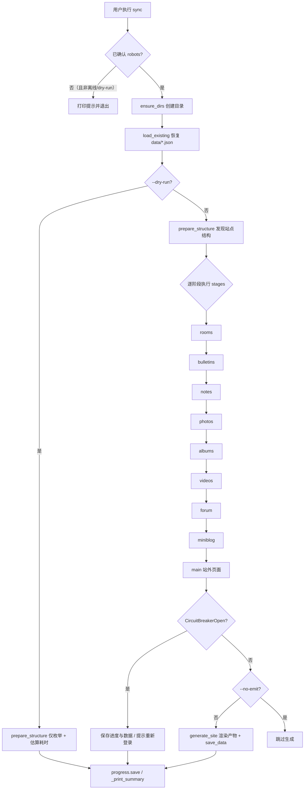
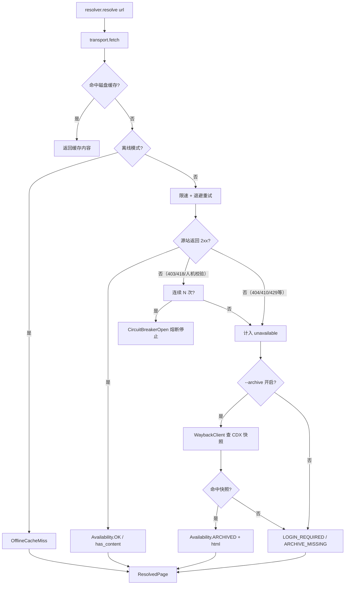
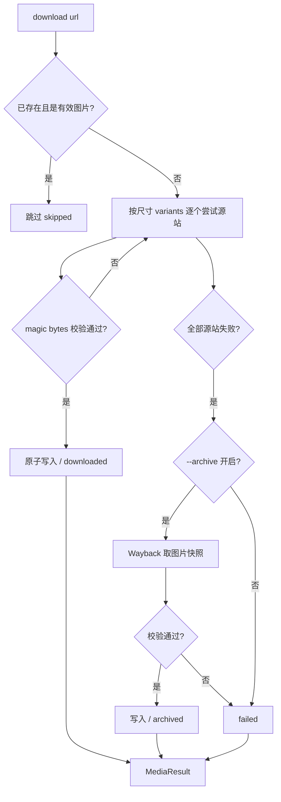
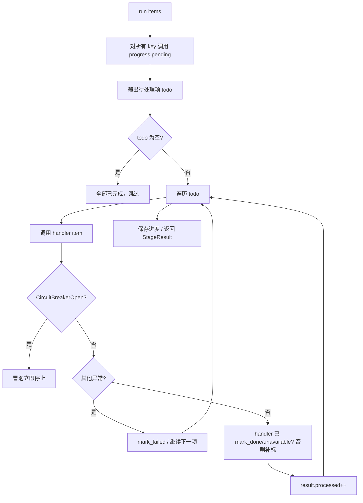

# 抓取器（scraper）逻辑说明

把「兔子山的小站」（豆瓣小站 211330）的内容归档为一个可本地阅读、可离线浏览的
VitePress 站点。本文件说明 `scraper/` 下各模块的协作逻辑、每条流水线阶段的职责，
并附流程图。

阅读顺序建议：先看 [总览](#一-总览) 与 [架构](#二-模块架构与职责)，再看
[核心流水线 sync](#四-核心流水线-sync) 的逐阶段说明，最后看 [流程图](#八-流程图)。

---

## 一、总览

抓取器以「**单线程 + 最小间隔 + 指数退避 + 熔断**」的方式礼貌地抓取源站，
把全部 HTML、图片、评论等内容落盘，再离线渲染成 Markdown 产物。它刻意**不规避风控**：
复用真实浏览器的 TLS 栈（不手工伪造；详见 [3.2](#32-两种传输实现)、
[3.3](#33-传输方式的选择哪些用浏览器headlesschrome哪些用-curl) 与
[3.5 可探测性说明](#35-关于可探测性诚实说明它确实非浏览器)）、不轮换 UA、不轮换代理，
靠「真 Chrome 的 TLS 栈 + 真人登录 + 低频 + 熔断即停」降低风险。
**注意：本工具并不伪装成真人浏览器，可被识别为自动化客户端——这是有意的不规避风控，见 3.5。**

设计上的三条支柱（断点续接的基础）：

| 持久化文件 | 作用 | 续跑时的行为 |
| --- | --- | --- |
| `state/cache/` | HTML / 图片原始响应缓存（按域名分目录） | 命中则零网络请求 |
| `state/progress.json` | 每个抓取单元的状态机 | 已完成项直接跳过 |
| `state/manifest.json`（生成于 `data/`） | 内容级单一事实源 | 决定产物如何重新生成 |

任意阶段被中断（Ctrl-C / 断网 / 熔断）后，直接重新执行同样的命令即可：
已完成单元由 `progress.json` 跳过，已抓内容由 `cache/` 命中，已下载图片按
「文件存在性 + magic bytes」校验跳过。

### 子命令

| 命令 | 作用 |
| --- | --- |
| `sync` | 抓取 + 生成站点（增量；已完成单元自动跳过） |
| `emit` | 仅根据已有数据重新生成产物（离线，零网络请求） |
| `discover` | 只枚举站点结构，不抓详情（用于预估规模） |
| `report` | 输出 `progress.json` 的 Markdown 进度报告 |
| `verify` | 校验归档结果（数量对账、断链、图片完整性等 7 项） |
| `login` | 打开浏览器完成豆瓣登录并保存会话（工具不接触密码） |
| `test` | 跑 HTML→Markdown 转换的回归测试 |

---

## 二、模块架构与职责

```
cli.py          ← 命令行入口：编排各阶段成一条可断点续接的流水线
 ├─ SyncContext       一次运行全部依赖与累积结果的容器
 ├─ prepare_structure + stage_*  9 个阶段函数
 └─ generate_site     把抓取结果渲染成站点产物

discover.py    站点结构发现：房间 → 功能模块 → 内容 ID 全集
resolver.py    页面解析层：抓取 → 失败标记 → Internet Archive 补足
transport.py  Transport 协议（定义 Fetcher / BrowserFetcher 的统一接口）
http_client.py 抓取传输骨架：磁盘缓存 + 限速 + 退避重试 + 熔断 + 统计
browser.py     Playwright 浏览器传输实现（继承 http_client.BaseFetcher）
media.py       图片归档：URL 升级、带 Referer 下载、完整性校验、archive 兜底
auth.py        登录会话管理（工具不接触密码，只保存 cookies）
archive.py     Internet Archive（Wayback Machine）补足客户端
progress.py    ProgressStore 状态机 + StageRunner 阶段执行器
index_map.py   把索引①/② 公告解析为分类映射（sidebar 唯一事实源）
parsers.py     HTML → 结构化数据（各选择器集中于此）
html2md.py     HTML 片段 → Markdown（含 link2 解码、站内链接重写）
emit.py        产物生成：Markdown 页面、sidebar、manifest、索引页、不可访问清单
verify.py      归档结果七项校验
config.py      全局配置（站点常量、礼貌参数、路径布局）
models.py      数据模型（Note / Album / Bulletin / Video / Discussion / …）
util.py        通用工具（JSON 读写、原子写入、时长/大小格式化等）
```

**关键设计：传输层可替换**。`http_client.Fetcher`（curl_cffi，快、轻）与
`browser.BrowserFetcher`（Playwright，能执行 JS、带登录态）都实现
`transport.Transport` 协议，因此 `resolver` / `media` 等消费方不关心自己拿到的是
哪一种后端，只依赖同一组方法与异常。两者共用同一套磁盘缓存、限速、退避、熔断与统计
（`BrowserFetcher` 继承 `BaseFetcher`，图片请求仍走内部 curl_cffi 以便复用尺寸升级与
magic bytes 校验链路）。

---

## 三、公共抓取能力（http_client + transport + resolver）

所有"取一个 URL"的动作都经过这一层，是抓取策略的集中落点。

### 3.1 抓取骨架（BaseFetcher）

`fetch(url)` 的执行顺序：

1. **读缓存**：若 URL 已在 `state/cache/<域名>/` 命中且状态码不是「暂时性失败」
   （429/5xx），直接返回，并 `cache_hits += 1`。
2. **离线模式**：`--offline` 下缓存未命中则抛 `OfflineCacheMiss`（不让"本地没有"被
   误记为"源站不可访问"）。
3. **上路**：经 `RateLimiter` 限速后发起网络请求：
   - **限速**：两次请求**开始**之间至少间隔 `delay_min ~ delay_max` 秒（随机抖动）。
     计时从上次请求开始算起，浏览器导航耗时会被吸收进间隔。
   - **退避重试**：429/5xx 等可重试状态码、以及连接/超时/SSL 等网络异常，交给
     `tenacity` 做「指数退避 + 抖动」重试，最多 `max_retries` 次。
   - **熔断**：连续 `circuit_break_after`（默认 3）次被拦截（403/418 或人机校验）
     立即抛 `CircuitBreakerOpen` 停止，避免把 IP 拖进黑名单。
   - **缓存写入**：4xx 视为确定性结果并缓存；429/5xx 不缓存（避免永久失败）。

### 3.2 两种传输实现

- **Fetcher（curl_cffi）**：用 `impersonate="chrome"` 使用真实浏览器 TLS 指纹。
  目标站点校验 TLS 指纹，裸 `requests` 会连续 `SSLEOFError`，因此用业界标准库而非
  自行拼请求头。
- **BrowserFetcher（Playwright + 系统 Chrome）**：默认启用，**HTML 页面一律走无头
  Chrome**（curl 回退路径已移除，见 `cli.py` 的 `SyncContext`）；无头与否可由
  `USAGI_BROWSER_HEADLESS` / `headless` 构造参数配置（默认无头）。
  懒启动——只有真正联网时才创建浏览器；拦截图片/字体/统计资源以减少特征；把无头
  Chrome 的 `HeadlessChrome` UA 改回 `Chrome`（版本号取真实值，不伪造）；检测到
  `sec.douban.com` 人机校验即计入熔断并停止，提示重新登录，**不尝试绕过**。

> **「固定浏览器 TLS 指纹」是手工实现，还是靠 Chrome 本身？——靠库 / 靠 Chrome，不手工。**
> 本项目代码**没有手写任何 TLS 指纹字节**。具体分两种后端：
>
> - **HTTP 后端（curl_cffi）**：`impersonate="chrome"` 底层是 **curl-impersonate**——
>   一组打了补丁的 curl/OpenSSL 构建，把 Chrome 的 TLS ClientHello（密码套件、扩展、
>   ALPN、TLS GREASE、签名扩展、HTTP/2 的 SETTINGS 帧与伪头顺序等）原样回放出来。
>   指纹细节由这个经过大量站点验证的库维护，本项目只需声明 `impersonate="chrome"`，
>   **不拼任何请求头、不手动构造握手**。
> - **浏览器后端（真实 Chrome）**：TLS 指纹就是 **Chrome 进程自己生成的**——因为抓取时
>   真正拉起了一个系统 Chrome（见下 3.3）。指纹源自真实浏览器二进制，更不可能由本项目
>   代码伪造。
>
> 本项目唯一对"指纹"做的小动作只有 **UA 字符串规范化**：无头启动会让 Chrome 在 UA 里带
> `HeadlessChrome`，而有头时同一 Chrome 发的是 `Chrome`。这里把它改回 `Chrome`，且版本号
> 取浏览器自己的真实值（`navigator.userAgent`），只是抹掉"无头启动"这个副作用，**并不伪造
> 任何指纹**。同时明确**不做**这些事：`navigator.webdriver` 不修改（那才是真正的自动化标记，
> 改了反而违背"不规避风控"原则）、不轮换 UA、不轮换代理、不做指纹伪装。**这套方案刻意不伪装成
> 真人浏览器**（详见 [3.5](#35-关于可探测性诚实说明它确实非浏览器)）——降低风险靠的是
> 「真 Chrome 的 TLS 栈 + 真人登录 + 5~7s 间隔 + 单线程 + 熔断即停」的礼貌低频策略，而不是与风控对抗。

### 3.3 传输方式的选择：哪些用浏览器（HeadlessChrome）、哪些用 curl

`SyncContext` 在初始化时**永远**用 **`BrowserFetcher`** 作为页面传输（`cli.py` 的
`SyncContext.__init__`）：HTML 页面一律由无头 Chrome 抓取，**不再提供 curl（原
`--no-browser`）回退路径**——这是有意为之（见上一条"使用 headless 而非 curl"的要求）。
`--no-browser` 开关与 `USAGI_BROWSER` 环境变量均已废弃移除。

但要注意：**外层传输 ≠ 所有请求都走它**。具体落到每一类请求：

| 请求类型 | 实际使用的客户端 | 说明 |
| --- | --- | --- |
| **HTML 页面抓取**（各阶段 `resolver.resolve` → `transport.fetch`） | **HeadlessChrome**（Playwright 导航 `domcontentloaded`，**无 curl 回退**，无头与否由 `USAGI_BROWSER_HEADLESS` 配置） | 日记/相册/照片/视频/论坛/广播/站外页/房间页等详情与列表页都走这里 |
| **图片下载**（`media.download` → `transport.get_image`） | **curl_cffi** | 即便外层是浏览器，图片也**委托给内部独立的 `Fetcher`**（`browser.py`），不进浏览器 |
| **Internet Archive 查询/抓取**（`WaybackClient`） | **curl_cffi** | archive 客户端内部自建 `Fetcher(_archive_config)`，与外层传输无关 |
| **会话校验**（`auth.check_session`） | **curl_cffi** | 直接用 curl_cffi `Session` 带 cookie 访问 `/mine/`，无需浏览器 |
| **登录流程**（`auth.run_login_flow`） | **有头 Chrome**（headless=False） | 用户需要看到登录窗口；此时连路由拦截都不开（验证码本身是图片，拦掉会渲染不出来） |
| **探测 Chrome UA**（`detect_chrome_ua`） | **无头 Chrome** | 仅用于报告展示真实浏览器版本，结果缓存在 `state/chrome_ua.txt` |

要点：

1. **图片永远走 curl_cffi**，哪怕外层是浏览器。原因（`browser.py` 模块文档）：
   - 图片是公开 CDN（`img*.doubanio.com`），不需要登录态；
   - 尺寸升级 + magic bytes 校验 + archive.org 兜底的整条链路都建在
     `get_image() → CachedResponse` 上，换浏览器会牵动业务逻辑；
   - 798 张图若走 `page.goto` 还会渲染整页、成本极高。
2. **HTML 页面永远走 HeadlessChrome，不再走 curl**：因为目标站点有反爬，部分页面需登录、
   可能触发人机校验，纯 HTTP 拿不全内容。浏览器后端（`BrowserFetcher`）与图片/archive 用的
   curl 后端**复用同一套**磁盘缓存、限速、退避、熔断与统计（都继承 `BaseFetcher`），
   所以增量同步、断点续接、`--offline`、`emit` 全部自动生效。
3. **archive.org 与登录态校验一律 curl/有头 Chrome**，与"抓页面用哪种传输"解耦。

### 3.4 页面解析（PageResolver.resolve）

`resolve(url)` 在「抓取」之上叠加失败判定与补足，返回 `ResolvedPage`：

1. 源站正常返回 → `Availability.OK`，`has_content = True`。
2. 源站不可访问（403/404/410/418/429 等）→ 进入 `_fallback`：
   - 若 `--archive` 开启且 Wayback 命中快照 → `Availability.ARCHIVED`
     （记录快照时间与链接，仍可拿到 `html`）。
   - 指向 `www.douban.com/note/`、`/topic/` 的路径 → `Availability.LOGIN_REQUIRED`
     （需登录，仍会尝试 archive）。
   - 否则 → `Availability.ARCHIVE_MISSING`（或 archive 关闭时为 `UNAVAILABLE`）。
3. 所有非 OK 的页面都记入 `unavailable`，最终产出 `data/unavailable.md` 清单。

`resolve_required` / `resolve_optional` 是为「关键路径必须成功」与「可选内容失败不中断」
两种语义提供的便捷封装。

### 3.5 关于可探测性（诚实说明：它确实"非浏览器"）

上面对"复用真实浏览器 TLS 指纹"的描述**不是**在说这套方案能伪装成真人浏览器。从技术上讲，
它**很容易被识别为自动化客户端**，这一点必须说清楚：

1. **页面抓取（默认无头 Chrome）可被 JS 检测**：Playwright 拉起的无头 Chrome 其
   `navigator.webdriver === true`。本项目**故意不遮这个标记**（见 3.2 引用块）——它是真正的
   自动化信号。代码只把 UA 里的 `HeadlessChrome` 改回 `Chrome`（版本取真实值），但 webdriver
   标记照留。任何在页面上跑 JS 的 bot 检测都能一眼识破。
2. **媒体抓取不是 Chrome，是 libcurl**：图片走 curl_cffi（curl-impersonate），TLS 指纹像
   Chrome，但它根本不是浏览器、UA 是写死的字符串、完全不执行 JS。"页面来自无头 Chrome、
   图片来自 libcurl"是**两个不同的客户端栈**，对同一批内容做关联请求时本身就是一个 tell
   （不过豆瓣图床主要靠 Referer 防盗链，已在 `media.py` 用 `image_referer` 满足）。

**那为什么还能跑通？——看它真正在对抗什么。** 从代码可见，本工具实际面对的封锁是：

- **TLS 指纹校验**：裸 `requests` 首请求连续 `SSLEOFError` → curl-impersonate / 真 Chrome 的 TLS 栈即可过。
- **图片防盗链**：`img*.doubanio.com` 不带 Referer 返 418 → 强制带 Referer 即可过。
- **登录墙**：`/note/`、`/topic/` 需登录 → 标 `LOGIN_REQUIRED`，由真人登录的有头 Chrome 去抓。
- **人机校验重定向**：触发 `sec.douban.com` → 计入熔断、提示重登，**不绕过**。

要抓的内容是**服务端渲染**的，抓取在 `domcontentloaded` 即拿到完整 DOM，页面本身不需要 JS
执行。目前挡路的都是 TLS / Referer / 登录态问题，**没有证据显示豆瓣对这些页面下了
`navigator.webdriver` 检测**。因此"匹配 TLS + 带 Referer + 真人登录 + 低频熔断"恰好够用。

**但这是"故意不躲"，不是"躲得好"。** 项目立场是**不规避风控**：不遮 `webdriver`、不轮换 UA、
不轮换代理、不做指纹伪装。它的风险模型是「真 Chrome TLS 栈 + 真人登录 + 5~7s 间隔 + 单线程 +
熔断即停」的**礼貌低频归档器**，而非 undetectable scraper。若豆瓣哪天上了基于 `webdriver` 的
JS 挑战，浏览器路径会被抓——而本项目的应对是"停下、让人登录、重跑"，不是"加大伪装"。

> 准确的表述应为：它复用了真 Chrome 的 **TLS 栈**（浏览器路径）与一个 Chrome **匹配** 的
> TLS 栈（curl 路径）来过"TLS 这一关"，但两者都**不**呈现为真人会话，且均可被识别。

---

## 四、核心流水线 `sync`

`cmd_sync` 的执行流程（`cli.py:1372`）：

1. **前置校验**：未完成 `robots.txt` 确认（`--i-have-read-robots`）且非离线、非
   dry-run，则打印提示并退出。`ensure_dirs` 创建运行所需目录。
2. **恢复已有产物**：`ctx.load_existing()` 从 `data/*.json` 读回上次的笔记 / 相册 /
   公告 / 视频 / 论坛 / 广播 / 站外页面 / 索引分组 / 结构。这是断点续接的关键——
   被跳过的阶段此前产出的数据必须能恢复，否则生成阶段会出现「sidebar 全空」等问题。
3. **dry-run 预演**：若 `--dry-run`，只枚举结构并估算请求数与耗时，不抓取。
4. **准备结构**（`prepare_structure`）：按所选阶段发现站点结构。
5. **逐阶段执行**：按 `stages` 顺序调用 `STAGE_FUNCS` 中的阶段函数。
6. **生成站点**（除非 `--no-emit`）：`generate_site` 渲染全部产物并 `save_data`。
7. **收尾**：`progress.save`、打印摘要、写同步报告。

异常分支：
- `CircuitBreakerOpen` → 保存进度与数据，提示登录态可能失效，退出码 3。
- `KeyboardInterrupt`（Ctrl-C）→ 保存进度与数据，提示重新执行续跑，退出码 130。

### 4.1 准备结构（prepare_structure / discover.py）

按站点层级逐层发现内容 ID 全集（所有列表页都走 HTTP 磁盘缓存，重复运行零成本）：

1. `discover_rooms`：抓首页 → 解析房间导航 → 逐个房间抓取其功能模块
   （`bulletin / notes / photos / videos / forum / miniblog` 六大类 `Widget`）。
   首页对应的房间 302 回首页，复用已抓 HTML。
2. `discover_bulletins`：抓取所有公告栏（含索引①/②）。
3. `discover_notes`：对每个 `notes` 模块分页枚举（`?start=N`，每页 10 条）全部日记条目。
4. `discover_photos`：对每个 `photos` 模块分页枚举全部照片 ID，并记录相册标题。
5. `discover_videos`：视频模块的独立列表页会 302，列表数据在房间页内，故抓房间页解析。
6. `discover_forum`：抓取各论坛模块的讨论帖列表。

`main` 阶段依赖索引①/② 的内容定位站外条目，因此若选了 `main` 而尚无公告栏数据，
会补跑 `discover_bulletins`。

### 4.2 九个阶段（stage_*）

每个阶段都通过 `StageRunner.run` 执行：
- 用 `ProgressStore.pending` 筛出「仍需处理」的项（已完成自动跳过；
  `--force` 强制重抓；`--recheck-unavailable` 重新探测已标记不可达的项）。
- `handler` 抛 `CircuitBreakerOpen` 会冒泡立即停止；其他异常记为 `FAILED` 并继续，
  保证单个坏页面不阻塞整体归档。

| 阶段 | 函数 | 逻辑说明 |
| --- | --- | --- |
| **rooms** | `stage_rooms` | 结构已在准备阶段获得。逐项把房间 + 模块数标记为 done（无模块则标记 unavailable）。 |
| **bulletins** | `stage_bulletins` | 对每个公告栏 `widget`：解析其房间页 → `parse_bulletin` 得到标题与正文 HTML。索引①/② 的解析延后到生成阶段统一重建。 |
| **notes** | `stage_notes` | 对每篇日记：解析详情页 → `parse_note` 得到标题/日期/正文/评论数；用 `media` 归档配图并建立 `{源URL:站内URL}` 重写映射；收集评论（服务端静态渲染、免登录，按 `?start=N` 翻页，每页 10 条，按 `comment_id` 去重）。正文拿不到时仍保留列表页元信息，页面带提示块。 |
| **photos** | `stage_photos` | 对每张照片：解析详情页 → 分别归档**预览图**（页面 ``，`docs/public/media/albums/{albumId}/{photoId}.{后缀}`）与**原图**（"查看原图"链接的 `raw` 尺寸，`docs/public/media/albums/{albumId}/original/{photoId}.{后缀}`）。无论成败都缓存描述，供 albums 阶段复用，避免重复请求。 |
| **albums** | `stage_albums` | 汇总相册元信息（图片已在 photos 阶段归档）。解析相册列表页得到照片清单，复用 photos 阶段已解析的描述与已下载的本地路径。 |
| **videos** | `stage_videos` | 对每条视频：下载缩略图到 `docs/public/media/videos/{videoId}.jpg`；正片在优酷，不抓。按 `video_id` 幂等合并。 |
| **forum** | `stage_forum` | 对每个讨论帖：解析详情页，评论为静态渲染可完整归档。按 `discussion_id` 幂等合并。 |
| **miniblog** | `stage_miniblog` | 对每个广播室 `widget`：解析动态流；若列表页 302，回退到房间页。按 `status_id` 幂等合并。 |
| **main** | `stage_main` | 补抓索引①/② 里指向 `www.douban.com` 的页面（需登录，未登录会 302 到 sec.douban.com）。用独立 key `main:{page_id}`，使 `--recheck-unavailable` 只重试这些页面，不会重抓已归档的 144 篇日记。 |

> 阶段顺序由 `ALL_STAGES` 定义，可用 `--stages` 重排或只跑部分阶段。

### 4.3 图片归档（media.py）

四件必须处理好的现实问题：

1. **防盗链**：`img*.doubanio.com` 不带 `Referer` 返回 418，所有图片请求强制带
   `Referer: https://site.douban.com/211330/`。
2. **尺寸升级**：列表页给的是 `thumb`（13KB），归档时按偏好顺序升级到最大尺寸
   （相册 `large` 618KB、日记配图 `raw` 207KB）。
3. **相册要存两份**：详情页 `` 给的是**预览图**（现在多为 webp，网格里显示的那张），
   而"查看原图"链接指向 `raw` 尺寸的**原图**（上传时的原文件，多为 jpg）。
   两者都存在时各存一份（预览图留在相册目录，原图进 `original/` 子目录，
   避免后缀相同而互相覆盖），页面上点开看的是原图；没有原图时退化为同一个文件。
   `find_album_image` 在同一张照片存在多个后缀的副本时取 webp —— 像素尺寸相同但体积小得多。
4. **假成功**：源站出错可能返回 HTML 错误页而非图片。因此下载后一律做 **magic bytes
   校验**，不是真图片就换尺寸重试，再失败则走 archive.org 快照。

`download` 流程：已存在且是有效图片 → 跳过（幂等，追加到 `skipped`）；否则按
`variants` 顺序逐个尝试 → 校验 magic bytes → 原子写入；全部源站失败 → 若 `--archive`
开启则尝试 archive.org 图片快照；仍失败 → 标记 `failed`。

### 4.4 生成站点（generate_site / emit.py）

把抓取结果渲染成 VitePress 产物（以 `manifest` 为输入，幂等）：

1. `rebuild_context`：重建链接重写映射表（笔记 / 站外页 / 相册的 URL → VitePress 路由）。
2. `build_index_groups`：从已归档的公告栏内容重建索引①/② 分类结构（放在生成阶段而非
   抓取阶段，因抓取可能被整体跳过，但索引结构任何时候都必须能从已归档内容重建）。
3. **分类归属**：索引①/② 优先，未覆盖的日记归入 `Papico 日志`（fallback）分区。
4. 逐篇渲染：笔记、相册、首页、笔记索引、相册索引、关于页、视频、论坛、广播、站外页、
   sidebar、不可访问清单、manifest。
5. `save_data`：把中间产物写回 `data/`（供 `emit` 与人工查看）。

相册页的照片卡片刻意写成"裸 HTML + 语义化 class"，站点行为交给前端：

```html
<a class="photo-preview" href="{原图}" data-caption="…"></a>
```

网格里显示 webp 预览图（省流量），点开由 `docs/.vitepress/theme/lightbox.ts` 接管成
浮层预览原图 —— **先显示已加载的预览图、再在后台换成原图**，因为原图常有数 MB。
脚本按住 Cmd/Ctrl 点击或未加载时都不接管，此时链接就是普通外链（`target="_blank"`），
所以归档站点在 JS 失效的情况下依然可用。

### 4.5 登录与会话（auth.py）

`login` 子命令打开有头 Chrome，由用户自己完成扫码/短信/账号密码/图形验证码，工具
全程不接触密码，只做两件事：

1. `wait_for_login` 轮询检测登录成功（`dbcl2` 与 `ck` 两个 cookie 同时存在即视为已登录）。
2. 把登录后的 `storage_state`（cookies + localStorage）原子落盘到
   `state/douban.auth.json`，权限 0600 且加入 `.gitignore`；日志只用 `redact_state`
   输出摘要，**绝不包含 cookie 值**。

抓取时把这个状态注入浏览器上下文即可复用登录态。`check` 模式用 curl_cffi 带 cookie
访问 `www.douban.com/mine/`：200 即有效、403 即失效，无需启动浏览器。

### 4.6 Internet Archive 补足（archive.py）

当源站页面不可访问或需登录时，尝试从 Wayback Machine 取回快照：
- 仅用 **CDX 接口**（稳定且能自动匹配 URL 变体），不用常被限流的 `/wayback/available`。
- `id_` 修饰符取原始未改写内容（避免 Wayback 注入工具栏与链接重写污染归档）。
- 独立且更保守的限速（默认 10~15s）与退避（20s 起）。
- 默认关闭（`--archive` 显式开启），因为单次查询可能耗时 10~60s。

### 4.7 校验（verify.py）

`verify` 子命令执行 7 项检查并写 `data/verify-report.md`：
数量对账（manifest ↔ data ↔ 磁盘 md）、断链检查、图片完整性（全量 magic bytes）、
图片重复（按内容哈希）、frontmatter 必含字段、内容抽查（与缓存原始 HTML 做文本相似度）、
构建检查（由 `npm run docs:build` 承担，关闭死链忽略）。

---

## 五、进度与断点续接（progress.py）

`ProgressStore` 是断点续接的核心，每个抓取单元 key 形如
`note:{id}` / `photo:{album}:{id}` / `main:{page_id}` 等，状态机为：

- `DONE`：已成功抓取并归档。
- `UNAVAILABLE`：源站与 archive 均不可得，已记录标记，不再重试（可用
  `--recheck-unavailable` 重新探测）。
- `FAILED`：抓取出错，下次运行重试。
- `SKIPPED`：按策略主动跳过。

`pending(keys, ...)` 从给定 key 集合中筛出仍需处理的部分，是续跑的依据。
进度文件采用**原子写入**（同目录临时文件 + `os.replace`），进程被中断时状态文件不会
损坏。另设 `PARSER_REVISION`：修改选择器 / 转换规则后递增此值，会让此前标记的已完成
单元自动失效、用新解析器重跑（原始 HTML 都在本地缓存，零额外网络请求）。
离线模式下 `ProgressStore` 为只读，避免把"缓存未命中"误记为"源站不可访问"。

---

## 六、命令行参数要点

| 参数 | 说明 |
| --- | --- |
| `--i-have-read-robots` | 确认已阅读目标站点 robots.txt 并理解抓取策略（非离线 / 非 dry-run 的强制项） |
| `--offline` | 只读本地缓存与已抓取产物，绝不联网 |
| `--archive` / `--no-archive` | 启用 / 关闭 Internet Archive 补足（默认关闭） |
| `--browser` / `--no-browser` | 用无头浏览器抓取 / 退回纯 HTTP（默认启用浏览器） |
| `--delay N` | 请求间隔下限（秒），默认 5（豆瓣 Crawl-delay） |
| `--limit N` | 每阶段最多处理 N 项（冒烟测试用） |
| `--force` | 忽略进度，强制重抓 |
| `--recheck-unavailable` | 重新探测此前标记为不可访问的页面 |
| `--stages` | 指定要执行的阶段（逗号分隔） |
| `--no-emit` | 只抓取，不生成站点产物 |
| `--progress` / `--no-progress` | 显示 / 关闭进度条 |

---

## 七、数据模型（models.py，节选）

- `Note`：日记（标题、日期、正文 HTML、配图 `ImageRef`、评论 `Comment`、分类与索引序号）。
- `Album` / `PhotoMeta`：相册与照片（含本地路径、可用性状态）。
- `Bulletin`：公告栏 / 索引①/② 内容。
- `Video`：视频条目（缩略图本地路径，正片在外站）。
- `Discussion` / `Comment`：论坛讨论帖与评论。
- `MiniblogStatus`：广播室动态。
- `ExternalPage`：站外页面（需登录）。
- `IndexGroup` / `IndexEntry`：索引分组与条目。
- `SourceStatus` / `Availability`：抓取来源状态与可访问性枚举，贯穿各层。

---

## 八、流程图

### 8.1 整体流水线（sync）



### 8.2 单个 URL 的抓取与失败补足



### 8.3 图片归档（media.download）



### 8.4 阶段执行器（StageRunner.run）


